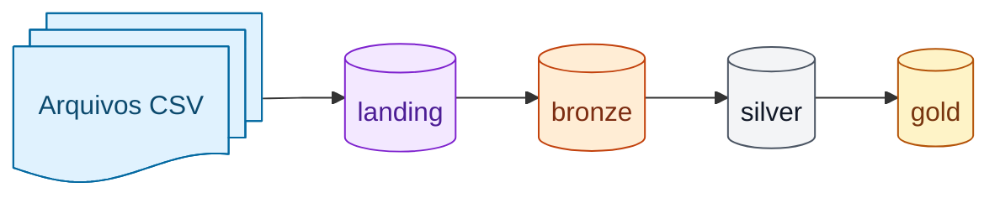

# São Paulo Crime Data

#### Projeto de Analytics Engineering com dbt + BigQuery

---

## Objetivo

Projeto focado na construção de uma camada analítica estruturada a partir de datasets históricos de ocorrências criminais do Estado de São Paulo (2022–2025).

* Aplicar arquitetura em camadas (`bronze -> silver -> gold`)
* Consolidar dados de vários períodos com schema canônico
* Uso avançado de recursos do dbt
* Governança e padronização
* Entregar tabelas analíticas prontas para consumo

---

## Arquitetura



### Bronze

* Espelhamento das fontes (seeds)
* Padronização inicial
* Materialização: `view`

### Silver

* Consolidação histórica dos anos 2022 a 2025
* Normalização de campos divergentes entre períodos
* Casting consistente e tratamento de datas
* Materialização: `table`

### Gold

* Agregações e tabelas finais para análise
* Indicadores por município, período e localização
* Materialização: `table`

---

## Dependências

Dependências principais do projeto (arquivo `requirements.txt`):

* `dbt-bigquery==1.11.0`
* `pandas==2.3.3`
* `pandas-gbq==0.33.0`

---

## Versão do Python

* Recomendado: `Python 3.13` (ou `3.12`)

---

## Configuração da conexão BigQuery (dbt)

Crie um arquivo `profiles.yml` para armazenamento de configurações no BigQuery.

Para detalhes, consulte:
[https://docs.getdbt.com/docs/core/connect-data-platform/bigquery-setup](https://docs.getdbt.com/docs/core/connect-data-platform/bigquery-setup)

---

## Comandos úteis

1. Verifique a conexão e o profile:

```bash
dbt debug
```

2. Instale as dependências do projeto:

```bash
dbt deps
```

3. Carregue as seeds:

```bash
dbt seed
```

4. Execute os modelos:

```bash
dbt run
```

5. Execute os testes (opcional):

```bash
dbt test
```

---

## Estrutura do projeto

```text
models/
  bronze/
  silver/
  gold/

seeds/
  seeds_schema.yml

macros/
  normalize_null_and_cast.sql
  generate_schema_name.sql
```

---

## Observações

* O projeto usa o profile `sp_crime_dbt` (definido em `dbt_project.yml`).
* As seeds são materializadas no schema `sp_crime_landing`.
* A separação física por camada pode ser controlada pela macro `generate_schema_name`.

## Fonte dos Dados

### Ocorrências (SSP-SP)

Os dados utilizados neste projeto foram extraídos do portal oficial da Secretaria da Segurança Pública do Estado de São Paulo (SSP-SP):

* [https://www.ssp.sp.gov.br/estatistica/consultas](https://www.ssp.sp.gov.br/estatistica/consultas)

Os arquivos disponibilizados publicamente pela SSP-SP contêm estatísticas de ocorrências por município e período. Neste projeto, os dados foram organizados como *seeds* para fins de modelagem e demonstração técnica.

### População (IBGE)

Para permitir análises normalizadas pela população (ex.: taxas por 100 mil habitantes), o projeto também referencia as **estimativas de população** do Instituto Brasileiro de Geografia e Estatística (IBGE), com data de referência em **1º de julho** e cobertura temporal **1991–2025**.

A tabela tratada pode ser acessada via Base dos Dados:

* [População Brasileira](https://basedosdados.org/dataset/d30222ad-7a5c-4778-a1ec-f0785371d1ca?table=2440d076-8934-471f-8cbe-51faae387c66)


