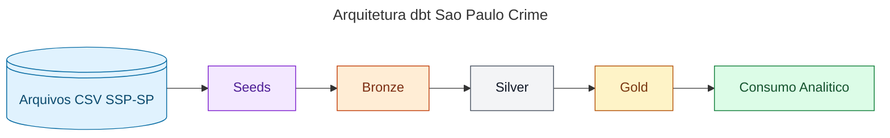

# dbt_sao_paulo_crime_data

Projeto de Analytics Engineering com `dbt + BigQuery` para modelagem e padronizacao de um dataset historico de ocorrencias criminais do Estado de Sao Paulo (2022-2025).

## Objetivo

- Aplicar arquitetura em camadas (`bronze -> silver -> gold`)
- Consolidar dados de varios periodos com schema canonico
- Reutilizar regras de transformacao com macros
- Entregar tabelas analiticas prontas para consumo

## Arquitetura



### Bronze

- Espelhamento das fontes (seeds)
- Padronizacao inicial
- Materializacao: `view`

### Silver

- Consolidacao historica dos anos 2022 a 2025
- Normalizacao de campos divergentes entre periodos
- Casting consistente e tratamento de datas
- Materializacao: `table`

### Gold

- Agregacoes e tabelas finais para analise
- Indicadores por municipio, periodo e localizacao
- Materializacao: `table`

## Dependencias

Dependencias principais do projeto (arquivo `requirements.txt`):

- `dbt-bigquery==1.11.0`
- `pandas==2.3.3`
- `pandas-gbq==0.33.0`

## Versao do Python

- Recomendado: `Python 3.13` (ou `3.12`)

## Configuracao da conexao BigQuery (dbt)

Crie um arquivo `profiles.yml` para armazenamento de configuracoes no BigQuery
Para detalhes,  consulte:
https://docs.getdbt.com/docs/core/connect-data-platform/bigquery-setup


## Comandos uteis

1. Verifique a conexao e o profile:
```bash
dbt debug
```

2. Instale as dependencias do projeto:
```bash
dbt deps
```

3. Carregue as seeds:
```bash
dbt seed
```

4. Execute os modelos:
```bash
dbt run
```

5. Execute os testes (opcional):
```bash
dbt test
```

## Estrutura do projeto

```text
models/
  bronze/
  silver/
  gold/

seeds/
  seeds_schema.yml

macros/
  normalize_null_and_cast.sql
  generate_schema_name.sql
```

## Observacoes

- O projeto usa o profile `sp_crime_dbt` (definido em `dbt_project.yml`).
- As seeds sao materializadas no schema `sp_crime_landing`.
- A separacao fisica por camada pode ser controlada pela macro `generate_schema_name`.

## Fonte dos Dados

Os dados utilizados neste projeto foram extraidos do portal oficial da Secretaria da Seguranca Publica do Estado de Sao Paulo (SSP-SP):

https://www.ssp.sp.gov.br/estatistica/consultas

Os arquivos disponibilizados publicamente pela SSP-SP contem estatisticas de ocorrencias criminais por municipio e periodo. Neste projeto, os dados foram organizados como seeds para fins de modelagem e demonstracao tecnica.
